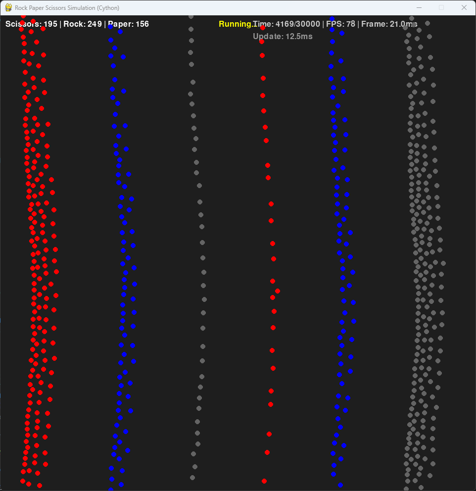

# Rock Paper Scissors Simulation

This is a simulation of multiple Rock-Paper-Scissors units moving around a map and interacting with each other based on the classic game's rules.


## Requirements

- Python 3.x
- Pygame
- NumPy
- Cython (for optimized version)
- Matplotlib (for benchmarking)

## Installation

```bash
pip install pygame numpy cython matplotlib
```

## Performance Optimization

This project includes both a pure Python implementation and a Cython-optimized version that offers significant performance improvements:

- The Cython implementation is approximately 2.5x faster than the pure Python version
- Computationally intensive operations like movement calculations, collision detection, and target finding have been optimized using Cython's static typing and C-level performance

To build the Cython module:

```bash
python setup.py build_ext --inplace
```

## How to Run

### Pure Python Version

Run the simulation with default settings (80 units of each type):

```bash
python rock_paper_scissors_sim.py
```

Or specify the initial number of scissors, rocks, and papers:

```bash
python rock_paper_scissors_sim.py 20 30 40
```

### Cython-Optimized Version

First, build the Cython module:

```bash
python setup.py build_ext --inplace
```

Then run the optimized version:

```bash
python rock_paper_scissors_sim_cython.py
```

You can also specify the initial unit counts:

```bash
python rock_paper_scissors_sim_cython.py 20 30 40
```

### Benchmark Comparison

To compare the performance of both implementations:

```bash
python benchmark_comparison.py
```

This will run both versions with the same parameters and generate a performance comparison graph saved as `benchmark_results.png`.

## Target Selection

Units now use a smarter, slightly randomized targeting system:
- Instead of always chasing the nearest prey, units select from the 3 closest prey
- There's an 80% chance they'll select the closest prey
- There's a 20% chance they'll select one of the other nearby prey
- This randomization creates more dynamic and unpredictable behavior

## Game Rules

- **Red circles**: Scissors - target and chase Paper
- **Gray circles**: Rocks - target and chase Scissors
- **Blue circles**: Paper - target and chase Rocks

Each unit has five behaviors:
1. **Attraction**: Units move toward a target unit that they can defeat:
   - Scissors chase Paper
   - Rocks chase Scissors
   - Paper chases Rocks

2. **Repulsion**: Units strongly flee from units that can defeat them:
   - Scissors flee from Rocks
   - Rocks flee from Paper
   - Paper flee from Scissors
   
3. **Group Behavior**: Units of the same type exhibit group behaviors:
   - **Cohesion**: Units are attracted to the center of mass of nearby same-type units (but only if not too close)
   - **Alignment**: Units tend to move in a similar direction as their same-type neighbors
   - **Separation**: Units maintain a minimum distance from other units of the same type, avoiding overcrowding
   
4. **Center Attraction**: Units are gently pulled toward the center of the map when they get too close to the edges, preventing edge clustering
   
5. **Random Movement**: Units have a random movement factor to add unpredictability to their behavior

When a unit collides with a unit that defeats it, it has a 30% chance to change to the type of the unit that defeated it:
- When Scissors hit Rock, the Scissors may become Rock
- When Rock hits Paper, the Rock may become Paper
- When Paper hits Scissors, the Paper may become Scissors

Units also bounce off the edges of the screen rather than sticking to them.

The simulation ends when only one type of unit remains, declaring that type as the winner.

## Controls

- Close the window to end the simulation at any time.
- The simulation also includes a time limit of 3000 frames, after which the type with the most units is declared the winner.

## Visual Elements

- **Unit Type Counts**: Displayed at the top left of the screen
- **Status Messages**: Displayed at the top center of the screen
- **Time Counter**: Displayed at the top right of the screen
- **Green Lines**: Show attraction to targets (units that can be defeated)
- **Red Lines**: Show repulsion from threats (units that can defeat the current unit)
- **Cyan Lines**: Show group connections between units of the same type
- **White Lines**: Show separation forces between units that are too close to each other
